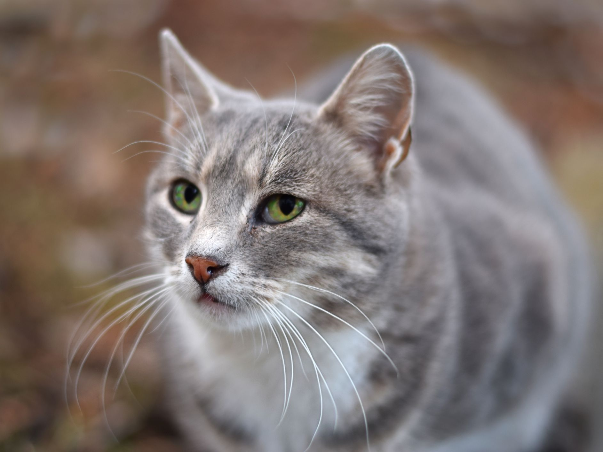

# Convolutional Neural Networks in TensorFlow

## Notebook

* Week 1 
   1. [Using more sophisticated images with Convolutional Neural Networks](Lesson/Week_1_01%20Using%20more%20sophisticated%20images%20with%20Convolutional%20Neural%20Networks.ipynb)
   2. **Exercise** : [Cats vs Dogs](Exercise/Exercise_1_Cats_vs_Dogs_Question-FINAL.ipynb)
* Week 2 
   1. [Cats vs Dogs Augmentation](Lesson/Week_2_01%20Cats%20vs%20Dogs%20Augmentation.ipynb)
   2. [Lesson 2](Lesson/Week_2_Lesson%202.ipynb)
   3. **Exercise** : [Cats vs Dogs Using Augmentation](Exercise/Exercise_2_Cats_vs_Dogs_using_augmentation_Question-FINAL.ipynb)
* Week 3 
   1. [Transfer Learning 1](Lesson/Week_3_01%20Transfer%20Learning.ipynb)
   2. [Transfer Learning 2](Lesson/Week_3_02%20Transfer%20Learning.ipynb)
   3. **Exercise** : [Horses vs Humans Using Transfer Learning](Exercise/Exercise_3_Horses_vs_humans_using_Transfer_Learning_Question-FINAL.ipynb)
* Week 4 
   1. [Multi Class Classification : RockPaperScissor](Lesson/Week_4_Multi%20Class%20Classification.ipynb)
   2. **Exercise** : [Multi Class Classifier](Exercise/Exercise_4_Multi_class_classifier_Question-FINAL.ipynb)

## Quizz

1. [Quizz Week 1](./Assets/Week%201_Quizz.png)
2. [Quizz Week 2](./Assets/Week%202_Quizz.png)
3. [Quizz Week 4](./Assets/Week%203_Quizz.png)
4. [Quizz Week 4](./Assets/Week%204_Quizz.png)

## Note

1. Kaggle : [The cats vs dogs dataset](https://www.kaggle.com/c/dogs-vs-cats)
2. Tensorflow : [Transfer Learning](https://www.tensorflow.org/tutorials/images/transfer_learning)
3. Andrew NG : [Dropout Layer](https://www.youtube.com/watch?v=ARq74QuavAo)
4. Laurence Moroney : [Rock-Paper-Scissors dataset](http://www.laurencemoroney.com/rock-paper-scissors-dataset/)
5. Tested Image for Notebook 
   **Cat**

   

   **Paper**

   